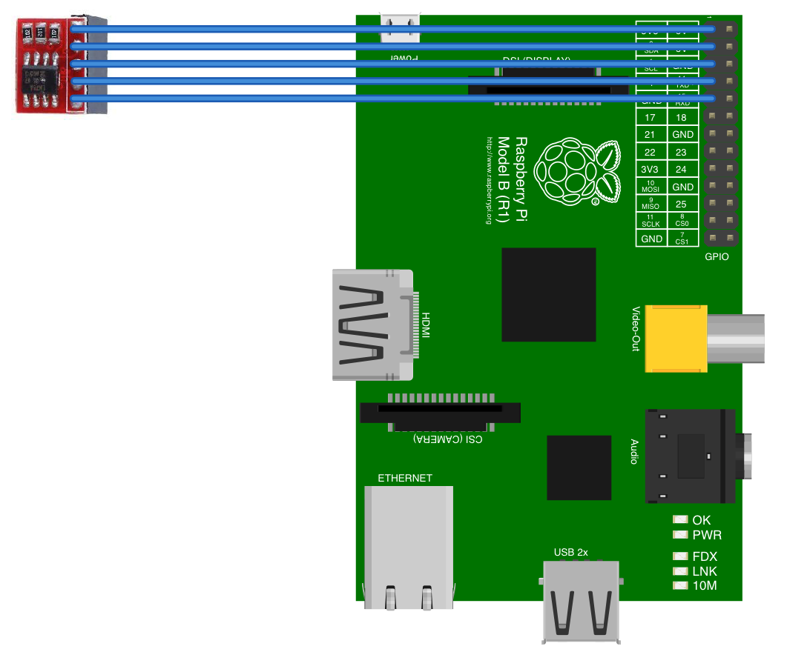

# LM75A
LM75A is a cheap temperature sensor that uses the I2C bus on your raspberry pi to read the current temperature. 
If yours come with the board as shown in photo below, you can hook it up to you pi. 


You can find some extremely cheap on AliExpress if you don't mind waiting. 

## Pinout


## Connection to the Raspberry Pi


## Temperature Read out code
```javascript
const I2C = require('raspi-i2c').I2C;

const readTemperature = (unit) => {
    const i2c = new I2C();

    let reading = i2c.readByteSync(0x48, 0x00);

    switch (unit) {
        case 'f':
            reading = (reading * 1.8 + 32)
            break;
        case 'c':
            // it's already in celsius
            break;
        case 'k':
            reading = reading + 273.15;
            break;
    }

    return Math.round(reading);
};

readTemperature();

```