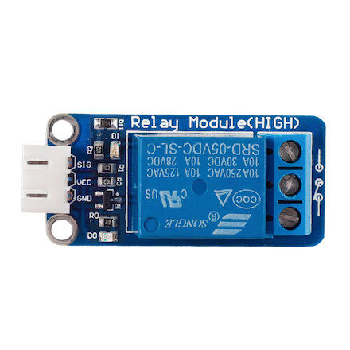

# Relay Boards
Relay boards are 1, 2, 4, 8 and 16 channel boards that can act as switches for your home automation. You can run the main power through them and control if they should complete the circuit or not. 



This is a one channel relay. It runs on 5 volts so `VCC` and `GND` pins will run the 5 volts into the board and the `SIG` pin is to activate or the activate the relay. 

The right side is where you run the main power through. You only need to use two of the three possible inputs. The print out on the board shows if the circuit is completed or not in inactive state. If you were to connect the upper two inputs, the circuit will be completed when the relay is activated. 


## Code
```javascript
var rpio = require('rpio');
rpio.init({ mapping: 'physical' });
const pin = 8; //physical pin number on pi board;
rpio.read(pin); //1 --> inactivated 0 --> activated
rpio.write(pin, rpio.LOW) //activate
rpio.write(pin, rpio.HIGH) //deactivate
```

# LM75A
LM75A is a cheap temperature sensor that uses the I2C bus on your raspberry pi to read the current temperature. 
If yours came with the board as shown in photo below, you can hook it up to you pi. 
This is what is printed on the board: 
`LM75 Temperature Sensor Module V1.0 2025ABQ09619H2`


You can find some extremely cheap on AliExpress if you don't mind waiting. 

## Pinout


## Connection to the Raspberry Pi
You first need to open you I2C bus, follow the steps here: 
https://www.youtube.com/watch?v=v4rfy9od5Lo


## Temperature Read out code
Synchronously 
```javascript
const I2C = require('raspi-i2c').I2C;

const readTemperature = (unit) => {
    const i2c = new I2C();

    let reading = i2c.readByteSync(0x48, 0x00);

    switch (unit) {
        case 'f':
            reading = (reading * 1.8 + 32)
            break;
        case 'c':
            // it's already in celsius
            break;
        case 'k':
            reading = reading + 273.15;
            break;
    }

    return Math.round(reading);
};

readTemperature();

```

Asynchronously 
```javascript
const I2C = require('raspi-i2c').I2C;
const readTemperature = i2c.readByte(0x48, (e, temp) => {
    const i2c = new I2C();
    
    if (e) {
        console.log('error reading the temp');
    }
    return temp;
});

readTemperature();
```