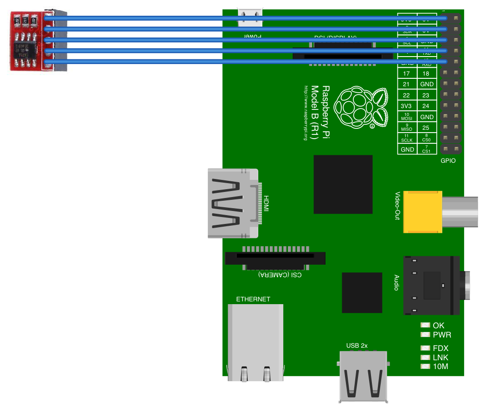

# LM75A
LM75A is a cheap temperature sensor that uses the I2C bus on your raspberry pi to read the current temperature. 
If yours came with the board as shown in photo below, you can hook it up to you pi. 
This is what is printed on the board: 
`LM75 Temperature Sensor Module V1.0 2025ABQ09619H2`


You can find some extremely cheap on AliExpress if you don't mind waiting. 

## Pinout


## Connection to the Raspberry Pi
You first need to open you I2C bus, follow the steps here: 
https://www.youtube.com/watch?v=v4rfy9od5Lo



## Temperature Read out code
Synchronously 
```javascript
const I2C = require('raspi-i2c').I2C;

const readTemperature = (unit) => {
    const i2c = new I2C();

    let reading = i2c.readByteSync(0x48, 0x00);

    switch (unit) {
        case 'f':
            reading = (reading * 1.8 + 32)
            break;
        case 'c':
            // it's already in celsius
            break;
        case 'k':
            reading = reading + 273.15;
            break;
    }

    return Math.round(reading);
};

readTemperature();

```

Asynchronously 
```javascript
const I2C = require('raspi-i2c').I2C;
const readTemperature = i2c.readByte(0x48, (e, temp) => {
    const i2c = new I2C();
    
    if (e) {
        console.log('error reading the temp');
    }
    return temp;
});

readTemperature();
```